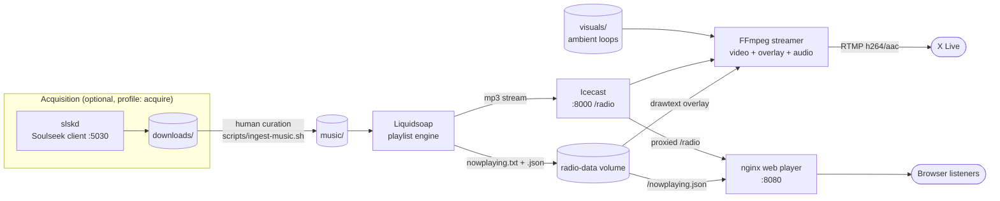

# LOFI 247

**A self-hosted, 24/7 lofi radio station that live-streams to X (Twitter) — with animated ambient visuals, a now-playing overlay, and a browser-based web player.**

Point it at a folder of music and a folder of looping background videos, give it an X
stream key, and it runs forever on a cheap VPS: Liquidsoap shuffles the playlist,
Icecast distributes the audio, FFmpeg composites the video + now-playing text and
pushes RTMP to X, and nginx serves a visual player for anyone listening in a browser.

- **Audio engine** — [Liquidsoap](https://www.liquidsoap.info/) playlist rotation with graceful fallbacks
- **Distribution** — [Icecast](https://icecast.org/) mountpoint, consumed by both the streamer and the web player
- **Video** — looping ambient loops (AI-generated with Seedance 2.0) composited by [FFmpeg](https://ffmpeg.org/) with a live now-playing overlay
- **Web player** — static nginx site with same-origin audio (Web Audio API visualizer works with no CORS games)
- **Acquisition (optional)** — a [slskd](https://github.com/slskd/slskd) Soulseek client behind a compose profile, feeding a human-curated ingest step — never the live broadcast directly

> [!WARNING]
> **Licensing — read this before you go live.**
> Publicly rebroadcasting music on X requires the rights to do so. Streaming tracks you
> do not have a license for **will** get you DMCA takedowns and can get your X account
> suspended. The bundled Soulseek client is included only for acquiring content you
> already have the rights to distribute. See [docs/MUSIC.md](docs/MUSIC.md) for legal
> sourcing options (label agreements, Creative Commons, royalty-free catalogs,
> commissioning artists directly).

## Architecture



Five Docker services, one shared `radio-data` volume for now-playing metadata, all
`restart: unless-stopped`. If the music folder is empty the stream falls back to an
ambient bed (or silence) instead of dying; if the visuals folder is empty the streamer
generates a procedural gradient-and-grain loop on the fly. The FFmpeg push wraps
itself in an infinite retry loop, so transient network blips and X-side hiccups
self-heal.

## Quickstart

On a VPS (Ubuntu 24.04 recommended — see [docs/VPS-SETUP.md](docs/VPS-SETUP.md) for
the full walkthrough including the bootstrap script):

```bash
git clone https://github.com/YOURNAME/lofi247.git
cd lofi247
cp .env.example .env
# Fill in: X_RTMP_URL + X_STREAM_KEY (see docs/X-STREAMING.md),
#          ICECAST_SOURCE_PASSWORD, ICECAST_ADMIN_PASSWORD,
#          STATION_NAME, OVERLAY_HANDLE
nano .env

# Add content (run these from your local machine)
rsync -av ~/my-lofi-tracks/  user@vps:~/lofi247/music/
rsync -av ~/my-loops/        user@vps:~/lofi247/visuals/

# Launch
docker compose up -d

# Watch it come up
docker compose logs -f streamer
./scripts/status.sh
```

Open `http://your-vps:8080` for the web player. Your X broadcast goes live once the
encoder connects and you start the broadcast in X Live Studio — full click path in
[docs/X-STREAMING.md](docs/X-STREAMING.md).

To also run the optional Soulseek client:

```bash
docker compose --profile acquire up -d
```

## Repo layout

| Path | What it is |
|---|---|
| `docker-compose.yml` | The whole stack: icecast, liquidsoap, streamer, web, slskd (optional) |
| `.env.example` | Every knob, documented — copy to `.env` and fill in |
| `engine/liquidsoap/radio.liq` | Playlist logic, fallback chain, now-playing writes |
| `engine/streamer/` | Custom FFmpeg container + entrypoint (compositing, overlay, RTMP push, retry loop) |
| `engine/nginx/default.conf` | Web player vhost: static files, `/nowplaying.json`, `/radio` proxy |
| `web/` | Browser player (HTML/CSS/JS, Web Audio visualizer) |
| `music/` | Your curated library — what actually broadcasts |
| `visuals/` | Looping background videos (see [docs/VISUALS.md](docs/VISUALS.md)) |
| `downloads/` | slskd landing zone — **never** broadcast directly |
| `scripts/vps-setup.sh` | Idempotent Ubuntu 24.04 bootstrap (Docker, UFW, dirs) |
| `scripts/status.sh` | One-glance operator status |
| `scripts/ingest-music.sh` | Curation step: downloads → music |
| `scripts/prep-visual.sh` | Normalize/transcode videos for the streamer |
| `docs/` | Everything below |

## Documentation

| Doc | Covers |
|---|---|
| [docs/VPS-SETUP.md](docs/VPS-SETUP.md) | Provider sizing + pricing, Ubuntu 24.04 setup, firewall, deploy, updating |
| [docs/X-STREAMING.md](docs/X-STREAMING.md) | Getting an X RTMP URL + stream key, encoder settings, 24/7 broadcast strategy, Restream fallback |
| [docs/MUSIC.md](docs/MUSIC.md) | Sourcing music legally, ingest workflow, library conventions |
| [docs/VISUALS.md](docs/VISUALS.md) | Generating ambient loops (Seedance 2.0), prepping them for the streamer |

## Requirements

- A VPS with Docker — 2 vCPU / 4 GB RAM comfortably handles 720p30 (see sizing guide)
- An X account with **X Premium** (required for RTMP stream keys)
- Music you have the rights to broadcast
- Optional: ambient video loops (the streamer generates a fallback visual if you have none)

## Credits

Built on the shoulders of excellent open source:
[Liquidsoap](https://www.liquidsoap.info/) ·
[Icecast](https://icecast.org/) ·
[FFmpeg](https://ffmpeg.org/) ·
[nginx](https://nginx.org/) ·
[slskd](https://github.com/slskd/slskd)

Visual loops generated with Seedance 2.0. Inspired by every lofi girl studying at
2am, everywhere.

## License

Code in this repo is yours to fork and run. The music and visuals you stream through
it are your responsibility — see the warning above.
